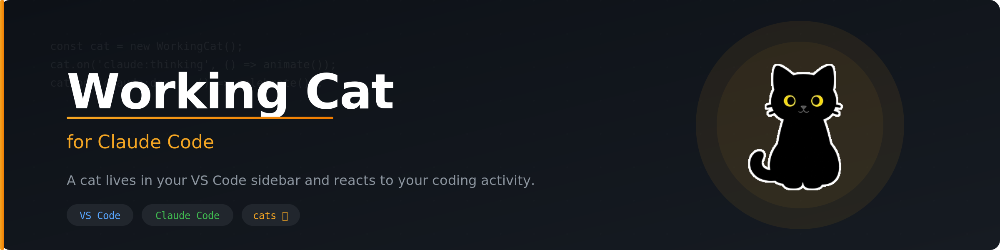
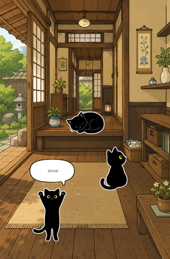

[](https://github.com/qvtec/vscode-working-cat)

<div align="center">

[](https://marketplace.visualstudio.com/items?itemName=qvtec3.vscode-working-cat)
[](https://github.com/qvtec/swagger-php-annotation/blob/main/LICENSE)
<!-- [](https://marketplace.visualstudio.com/items?itemName=qvtec3.swagger-php-annotation)
[](https://github.com/qvtec/swagger-php-annotation/stargazers) -->

[📦 VS Code Marketplace](https://marketplace.visualstudio.com/items?itemName=qvtec3.vscode-working-cat) • [🐛 Issues](https://github.com/qvtec/vscode-working-cat/issues) • [📋 Changelog](https://github.com/qvtec/vscode-working-cat/blob/main/CHANGELOG.md) • [🇯🇵 日本語](README.ja.md)

</div>

A cat lives in your VS Code sidebar and reacts to your coding activity — and to your Claude Code sessions.

<table><tr>
<td></td>
<td></td>
</tr></table>

## Features

- **Editor cat** — animates on typing, saving, errors, and idle
- **Claude Code cats** — each active session gets its own cat with a walking entrance animation
- **Multi-session support** — multiple cats appear at once for concurrent Claude sessions
- **Session titles** — displayed each Claude cat
- **Draggable cats** — drag any cat to reposition it freely
- **Cat sounds** — meows on key events, toggleable with volume control
- **Snooze reminders** — plays a sound at set intervals while waiting for permission
- **Background scenes** — choose your backdrop

## Requirements

- **Platform**: Windows, macOS, or Linux (including WSL2)
- **VS Code**: 1.70.0 or later
- [Claude Code](https://claude.ai/code) (for Claude session tracking)

## Getting Started

1. Install from the [VS Code Marketplace](https://marketplace.visualstudio.com/items?itemName=qvtec3.vscode-working-cat)
2. Open the **Working Cat** panel in the sidebar
3. Start coding — the cat reacts automatically
4. Launch a Claude Code session to see Claude cats appear

## Claude Code Integration

On first activation, Working Cat automatically registers hooks in `~/.claude/settings.json` to track your Claude Code sessions in real time. Back up your config if you have custom hooks.

To remove the hooks:
```
Working Cat: Unregister Claude Code Hooks
```

## What the cat reacts to

**Editor activity** — typing, saving, diagnostics errors, and idle time.

**Claude Code sessions** — session start, waiting for input, thinking, done, and permission requests.

**Sounds** — the cat meows on key events.

## Settings

| Setting | Default | Description |
|---------|---------|-------------|
| `workingCat.background` | `bg_park` | Background scene (`bg_park`: park garden, `bg_park_evening`: park evening, `bg_park_night`: park night, `bg_home`: Japanese house, `bg_cyberpunk`: cyberpunk city) |
| `workingCat.sound` | `true` | Enable/disable cat sounds |
| `workingCat.volume` | `0.5` | Sound volume (0.0 – 1.0) |
| `workingCat.snooze` | `false` | Play reminder sounds when waiting for permission |
| `workingCat.snoozeInterval` | `30` | Snooze interval in seconds (10–300) |
| `workingCat.snoozeCount` | `3` | Number of snooze reminders (1–10) |

