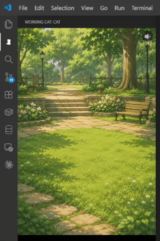

# Working Cat

[日本語版はこちら](README.ja.md)

A cat lives in your VS Code sidebar and reacts to your coding activity — and to your Claude Code sessions.



## Features

- Cat animations react to editor activity (typing, saving, errors, idle)
- Each active Claude Code session gets its own cat with a walking entrance animation
- Multiple cats can appear at once for multiple concurrent sessions
- Click a cat to focus the terminal running that Claude session
- Session title displayed under each cat
- Cat sounds on key events (toggleable, with volume control)
- Background scene selection

## Requirements

- Linux or macOS
- [Claude Code](https://claude.ai/code) (for Claude session tracking)

## Claude Code Integration

On first activation, Working Cat automatically registers hooks in `~/.claude/settings.json` to track your Claude Code sessions in real time.

To remove the hooks:
```
Working Cat: Unregister Claude Code Hooks
```

## Cat States

### Editor cat

| State | Meaning |
|-------|---------|
| idle | No activity |
| typing... | Editing a file |
| saved! | File just saved |
| error! | Diagnostics errors detected |
| zzz... | Idle for 5+ minutes |

### Claude Code cats

| State | Meaning |
|-------|---------|
| (walking in) | New session started — cat runs in from the side |
| (looking around) | Waiting for your input |
| thinking... | Claude is generating a response |
| done! | Claude finished — click to dismiss |
| waiting... | Claude is waiting for your permission |

## Cat Sounds

A 🔊 button appears in the top-right corner on startup — click it once to enable audio (required by browser autoplay policy).

| Event | Sound |
|-------|-------|
| Waiting for input | Hesitant meow × 1 |
| done! | Energetic meow × 1 |
| Permission request | Calm meow × 1 |

## Settings

| Setting | Default | Description |
|---------|---------|-------------|
| `workingCat.background` | `bg2` | Background scene (`bg1`: Japanese house, `bg2`: park garden) |
| `workingCat.sound` | `true` | Enable/disable cat sounds |
| `workingCat.volume` | `0.5` | Sound volume (0.0 – 1.0) |

## Known Issues

- Terminal focus on click only works when Claude is running in a VS Code integrated terminal.
- Hook registration modifies `~/.claude/settings.json`. Back up your config if you have custom hooks.
